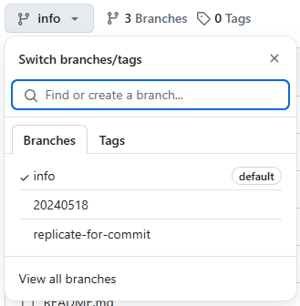

_Updated 24 May 2024 UTC_

# #MamaNyoSquad (Preview)

_**Enter the universe through the eyes of the Tengu! 💕**_

This repository contains all of the preview frameworks that might be implemented into upstream (`MamaNyoSquad/mamanyosquad.github.io`)! This is to ensure that the website follows a new "unified" design language that works well with all devices!

For more information about this change, check out this [Blog](https://mamanyosquad.github.io/blog/20240521).

## Table of Contents

- [Overview](#overview)
- [How This Works](#how-this-works)
- [Contributing to the Project](#contributing-to-the-project)
- [License](#license)

# Overview

This repository contains a collection of bleeding-edge website iterations which may be applied to our upstream repository [`mamanyosquad.github.io`](https://github.com/MamaNyoSquad/mamanyosquad.github.io), in accordance to the SquadMates' initiative to provide a new "unified" experience across the website.

The SquadMates -- both the [G.Mgr](https://github.com/thebelovedmoon) and the [SocWeb Mgr](https://github.com/Ortega082) -- and fellow collaborators can share ideas on how to improve the website, and provide ways to make it livelier.

Note that some web features -- like #MamaNyoSquad Publishing -- are excluded from this collaborative effort as this is under the G.Mgr's discretion.

# How This Works

This repository starts off with two main branches: `info` and `replicate-for-commit`. The first one contains all the necessary information to get started with the project, while the second contains first few files needed to start working on the project.

Branches replicated from `replicate-for-commit` will have its pre-defined `.devcontainer` which can be spun up at any time with GitHub Codespaces (powered by VS Code).

Powered by [nginx](https://nginx.org), necessary files are pre-outlined and can be customized to your own liking. Granted, they must follow the [GitHub Pages](https://github.io) framework on its file structure.

Full info about how this works will be in the [documentation](CONTRIBUTING.md).

# Contributing to the Project

We're open for collaborations with fellow frontend developers who aim to improve the website! You can check out the following details on how to contribute, preview, and spin your instance in our [documentation](CONTRIBUTING.md).

This repository follows our policies on Code of Conduct. Learn more about our approach in [our statement](CODE_OF_CONDUCT.md).

Concerns? You can contact the Squad via [email](mailto:mamanyosquad@outlook.com) or through our [G.Mgr](mailto:jelsa14018@gmail.com).

# License

This repository is licensed under [MIT](LICENSE) and [CC-BY-4.0](LICENSE-CONTENT).